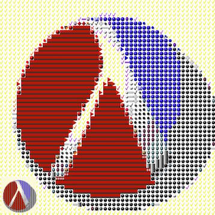

Mosaic generator
----------------
Hello. I wrote this mainly as an exercise to train my Scheme skills. Obviously you need to have DrRacket installed on your machine and have `racket` existing somewhere in the bin folders.

The way it works is in a couple of steps. So let's get started with it:

1. We need to set up our gallery folder. Let's call it X. This folder X will contain images that we would like to use in the destination image. Note that the utility will search for png files.
2. We need to create the average RGB values of all the files in X. We can do that by issuing the following command:
`racket avg-rgb.rkt /tmp/library > avg-rgb-vals.txt`
3. We need to figure out what our image input will be. Let's call its location Y.
4. Let N be the size of the crop we will be doing to the source image (NxN). Generate the output by issuing the following command:
`racket build-mosaic.rkt Y N avg-rgb-vals.txt > mosaic.html`

The above process will output an HTML file `mosaic.html` that contains references to all of the specified images in step 1 that match the best Euclidean distance.

Here is an example of a generated mosaic using a library of 100 random images:

Boro Sitnikovski

August 2016
